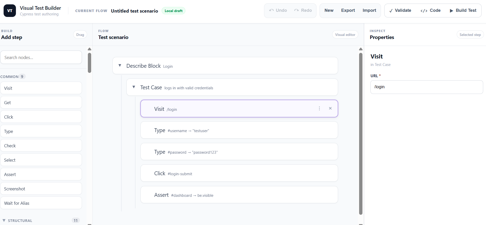
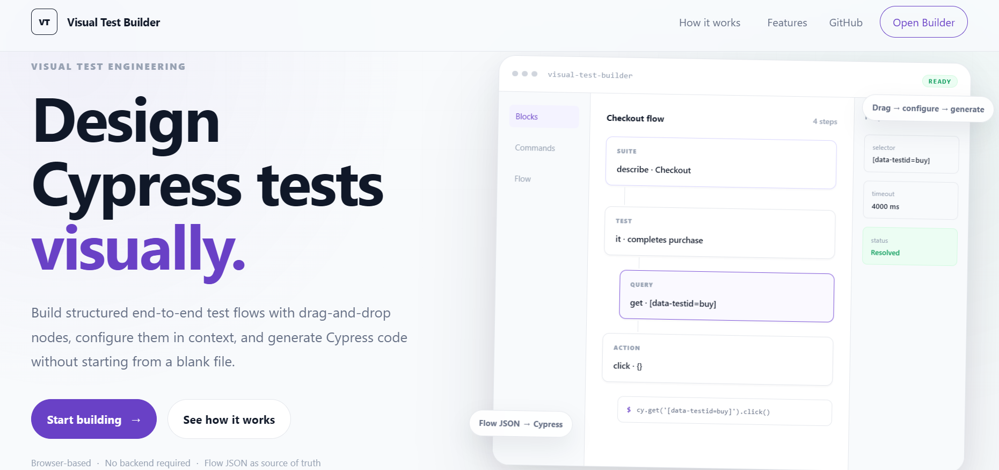
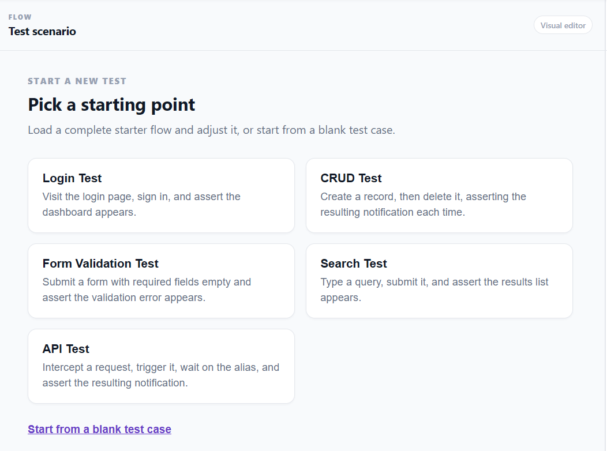
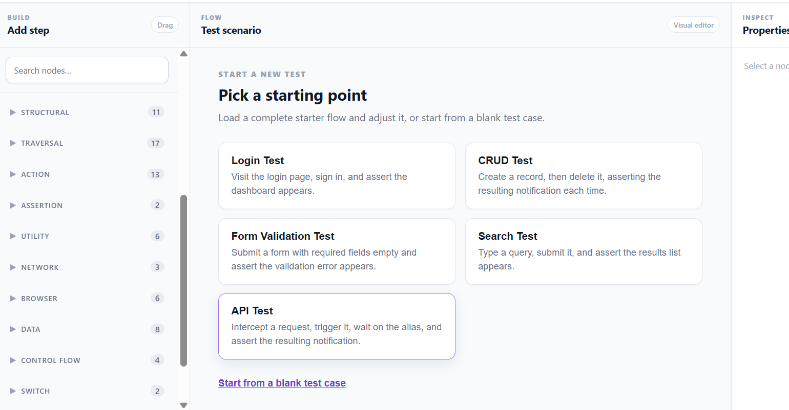
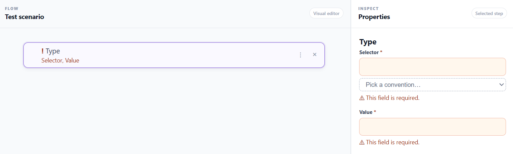
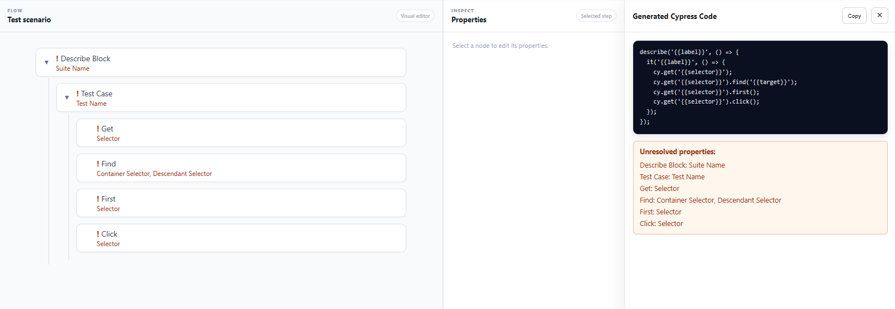
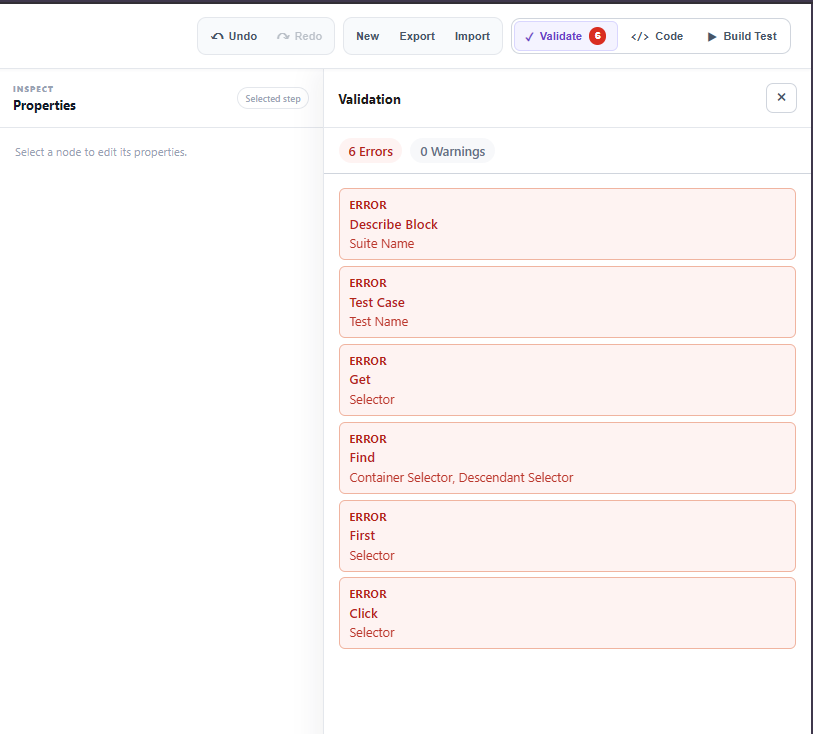

# Visual Test Builder

**Build Cypress E2E tests visually. Generate code. Stay in control of the output.**

Visual Test Builder is a browser-based tool for frontend developers who want to assemble Cypress end-to-end test flows visually, configure commands and assertions, validate the flow, and generate Cypress code.

Instead of writing every test step from scratch, you build a test flow, reuse common patterns, inspect the generated code, and take the result into your existing Cypress project.

**Try it:** [Open Visual Test Builder](https://visual-test-builder-one.vercel.app/)
**Source code:** [GitHub repository](https://github.com/pankaj-kumar-dev/visual_test_builder)

<!-- SCREENSHOT 01 — HERO
     File: docs/images/01-builder-overview.png
     Show: full builder workspace with the Login template loaded — palette (left), canvas tree (center),
     property editor (right), header buttons (Undo/Redo, New/Export/Import, Validate/Code/Build Test) visible.
     Suggested size: 1600x900. -->


> **Important:** Visual Test Builder **generates** Cypress code. It does **not run** your tests against your application. Review the generated files, resolve any dependencies, and execute them in your own Cypress environment. See [Generating code vs. running it](#generating-code-vs-running-it).

---

## Contents

- [What can you do with it?](#what-can-you-do-with-it)
- [Quick start (3 steps, no install)](#quick-start-3-steps-no-install)
- [Tutorial: build your first Cypress test](#tutorial-build-your-first-cypress-test)
- [Worked examples](#worked-examples)
- [Advanced usage](#advanced-usage)
- [Generating code vs. running it](#generating-code-vs-running-it)
- [Troubleshooting](#troubleshooting)
- [Limitations](#limitations)
- [Run it locally](#run-it-locally)
- [Documentation](#documentation)
- [License](#license)

---

## What can you do with it?

- Build test flows with a visual canvas and a searchable command palette (**56 commands** plus structural, composition, control-flow and workflow blocks).
- Start from one of **5 templates** (Login, CRUD, Form Validation, Search, API) or from a blank test case.
- Configure selectors, input values, URLs, assertions and other command properties in a context-aware property editor.
- Organize commands into real Cypress **chains** (`cy.get(...).find(...).click()`) and structured `describe` / `it` / hook blocks.
- Reuse **flows** (Login, Logout, Search, CRUD …) as generated Cypress custom commands, or save your own.
- Select several steps (Shift/Ctrl+click) to delete or duplicate them together; **undo / redo** any change.
- See validation problems live, with a badge count, and jump from a warning straight to the offending node.
- Inspect the generated code, copy it, or **Build Test** to download a compile-ready `*.cy.ts` spec (plus `commands.ts` when reusable flows are used).
- **Export / Import** your flow as `flow.json`. Your work is also auto-saved in your browser.

No account, sign-in, or install is needed. Everything runs in your browser.

---

## Quick start (3 steps, no install)

1. **Open the app** → [visual-test-builder-one.vercel.app](https://visual-test-builder-one.vercel.app/) and click **Open Builder** on the landing page.
2. **Pick a template.** On the empty canvas choose **Login Test** (or **Start from a blank test case**).
3. **Inspect the output.** Click **`</> Code`** in the header to see the generated Cypress code, or **▶ Build Test** to validate it and download the files.

<!-- SCREENSHOT 02 — LANDING PAGE
     File: docs/images/02-landing-page.png
     Show: landing page with the "Open Builder" button visible. -->


<!-- SCREENSHOT 03 — TEMPLATE PICKER
     File: docs/images/03-template-picker.png
     Show: empty canvas with the 5 templates + "Start from a blank test case" option. -->


---

## Tutorial: build your first Cypress test

We will build a **login test** step by step, then run it in a real Cypress project.

> The selectors in this tutorial (`#username`, `#password`, `#login-submit`, `#dashboard`) are **illustrative**. Replace them with selectors from *your* application. See [Choose stable selectors](#choose-stable-selectors).

### Step 1 — Open the app

Go to [visual-test-builder-one.vercel.app](https://visual-test-builder-one.vercel.app/) and click **Open Builder**. No account or setup is required. Your flow is saved automatically in your browser's `localStorage` (one flow per browser).

### Step 2 — Start with a template (or blank)

On an empty canvas you get a **Templates** panel:

| Template | What it builds |
| --- | --- |
| **Login Test** | Visit login page, sign in, assert the dashboard appears |
| **CRUD Test** | Create a record, delete it, assert a notification each time |
| **Form Validation Test** | Submit with required fields empty, assert the validation error |
| **Search Test** | Type a query, submit, assert the results list |
| **API Test** | Intercept a request, trigger it, wait on the alias, assert |
| **Start from a blank test case** | An empty `describe` > `it` to build from scratch |

Click **Login Test**. To start over later, click **New** in the header.

### Step 3 — Understand the structure

<!-- SCREENSHOT 04 — LABELLED WORKSPACE
     File: docs/images/04-workspace-labelled.png
     Show: workspace with numbered callouts drawn on it:
       1 Palette  2 Palette search box  3 Canvas tree  4 Suite (describe)  5 Test case (it)
       6 Command step  7 Property editor  8 Header: Validate / Code / Build Test
     (Add the numbers in any image editor, then keep this key below in sync.) -->


1. **Palette** (left) — every available block and command, grouped by category. Use the search box to find one (e.g. type `click`).
2. **Canvas** (center) — your flow as a tree: a **Suite** (`describe`) contains **Test cases** (`it`), which contain **command steps**.
3. **Property editor** (right) — fields for the selected step.
4. **Header** — Undo/Redo, New/Export/Import, and the **Validate**, **Code** and **Build Test** panels.

To add a step: drag a chip from the palette onto the canvas, **or** use the **+** (“Add step here”) control between steps and search for the command. Reorder with drag-and-drop or the node's `⋮` menu (Move up / Move down / Duplicate / Delete).

### Step 4 — Configure each command

Click a step on the canvas, then fill its fields in the property editor. A `*` marks a required field.

| Kind of value | Used by | Example |
| --- | --- | --- |
| **URL** | `visit` | `/login` |
| **Selector** | `get`, `click`, `type`, `should` … | `#username` |
| **Input value** | `type`, `select` | `testuser` |
| **Assertion** | `should` (dropdown: `be.visible`, `have.text`, `have.value` …) | `be.visible` |

For the Login template the flow reads:

```
describe  "Login"
└── it    "logs in with valid credentials"
    ├── visit   url=/login
    ├── type    selector=#username   value=testuser
    ├── type    selector=#password   value=password123
    ├── click   selector=#login-submit
    └── should  selector=#dashboard  assertion=be.visible
```

<!-- SCREENSHOT 05 — PROPERTY EDITOR
     File: docs/images/05-property-editor.png
     Show: a `type` step selected on the canvas, property editor showing Selector and Value fields. -->


### Step 5 — Understand command chaining

Commands placed **directly** under a test case are independent statements; each one finds its own element:

```js
cy.get('#login-submit');
cy.get('#login-submit').click();   // one statement, selector given in the step
```

To compose a real Cypress **subject chain**, drop a **Chain** block (Structural → Composition) into the test case and build inside it:

```
chain
├── get    selector=.items
├── find   selector=.item
├── first
└── click
```

generates:

```js
cy.get('.items')
  .find('.item')
  .first()
  .click();
```

Rules for a chain:

- The **first** command must be a *root* command (`get`, `contains`, `intercept`, `fixture`, …) — it creates the subject.
- Every command **after** it must be a *subject* command (`find`, `first`, `click`, `type`, `should` …).
- Inside a chain, the **Selector field is hidden** on subject commands — the subject already comes from the previous step.
- Invalid drops (e.g. `visit` inside a chain) are rejected while you drag.

<!-- SCREENSHOT 06 — CHAIN
     File: docs/images/06-chain-block.png
     Show: a chain block expanded with get > find > first > click on the canvas, and the matching code in the Code drawer. -->


### Step 6 — Review validation

Click **✓ Validate** in the header. A badge on the button shows the number of errors.

- Missing required fields are highlighted in orange on the canvas node and in the property editor.
- The Validate panel lists **errors** and **warnings**. **Click an entry** to select that node, expand any collapsed parents, and scroll it into view.
- Fix the field → the node highlight, field highlight, and panel entry all clear together.

<!-- SCREENSHOT 07 — VALIDATION PANEL
     File: docs/images/07-validation-panel.png
     Show: Validate panel open with at least one issue listed, header badge count visible, and the matching node highlighted on the canvas. -->


### Step 7 — Inspect and build the output

There are two panels. Only one is open at a time.

| Panel | Button | Use it to |
| --- | --- | --- |
| **Code** drawer | `</> Code` | Live view of the generated code. Copy it. Shows unresolved-property warnings. |
| **Build Test** panel | `▶ Build Test` | Validates, generates a named spec (e.g. `login.cy.ts`), **syntax-checks** it, lists **dependencies** (custom commands, fixtures) and offers **Download** for each file. |

<!-- SCREENSHOT 08 — CODE DRAWER
     File: docs/images/08-code-drawer.png
     Show: Code drawer open on the right with the Login test's generated code and the Copy button. -->


<!-- SCREENSHOT 09 — BUILD PANEL
     File: docs/images/09-build-panel.png
     Show: Build Test panel with "✓ Flow valid", "✓ Compile-ready (syntax)", Dependencies section and Download buttons. -->


Generated code for the Login template (from the current generator):

```js
describe('Login', () => {
  it('logs in with valid credentials', () => {
    cy.visit('/login');
    cy.get('#username').type('testuser');
    cy.get('#password').type('password123');
    cy.get('#login-submit').click();
    cy.get('#dashboard').should('be.visible');
  });
});
```

Download it as `login.cy.ts`.

> **"Compile-ready (syntax)" means the file parses as TypeScript. It does not mean the test will pass.** See the next step.

### Step 8 — Run the test yourself

The builder never runs your test. To run it:

1. **Have a Cypress project** (Cypress 12+). If you do not: `npm install --save-dev cypress`, then `npx cypress open` once to scaffold.
2. **Copy the spec** to `cypress/e2e/login.cy.ts`.
3. **If Build Test listed dependencies:**
   - *Custom command* → copy the downloaded `commands.ts` content into `cypress/support/commands.ts` (and make sure `cypress/support/e2e.ts` imports it).
   - *Fixture* → create the file shown, e.g. `cypress/fixtures/sample.json`.
4. **Set `baseUrl`** in `cypress.config.ts` so `cy.visit('/login')` reaches your app:
   ```ts
   import { defineConfig } from 'cypress';
   export default defineConfig({ e2e: { baseUrl: 'http://localhost:3000' } });
   ```
5. **Align the selectors** with your real DOM (`#username`, `#login-submit` … are placeholders).
6. **Run:** `npx cypress open` (interactive) or `npx cypress run --spec cypress/e2e/login.cy.ts` (headless).

<!-- SCREENSHOT 10 — CYPRESS RUN (optional)
     File: docs/images/10-cypress-run.png
     Show: Cypress Test Runner (or terminal) with the exported login.cy.ts passing against your own app. -->


Full details: [docs/DEVELOPMENT.md → Export Executability Check](docs/DEVELOPMENT.md#export-executability-check) shows how this repo proves a representative export runs in a real browser.

---

## Worked examples

All code below was produced by the current generator (`buildSpec`) from the flow shown.

### Example 1 — Basic UI test: visit, find, assert visible

Flow:

```
describe "Home page"
└── it "opens the application"
    ├── visit  url=/
    └── chain
        ├── get     selector=[data-testid="welcome"]
        └── should  assertion=be.visible
```

Output `home-page.cy.ts`:

```js
describe('Home page', () => {
  it('opens the application', () => {
    cy.visit('/');
    cy.get('[data-testid="welcome"]').should('be.visible');
  });
});
```

### Example 2 — Form interaction: type, submit, assert

Use the **Login Test** or **Form Validation Test** template, or build:

```
describe "Login" → it "logs in with valid credentials"
├── visit  /login
├── type   #username = testuser
├── type   #password = password123
├── click  #login-submit
└── should #dashboard be.visible
```

Output `login.cy.ts`: see [Step 7](#step-7--inspect-and-build-the-output).

### Example 3 — Advanced: chains, intercept, reusable flows, fixtures

Flow:

```
describe "Account"
└── it "logs in, saves, then logs out"
    ├── flowInvocation  flow=login  username=testuser  password=password123
    ├── chain
    │   ├── intercept  method=POST  url=/api/save
    │   └── as         name=saveRequest
    ├── chain
    │   ├── get    selector=[data-testid="save"]
    │   └── click
    ├── waitAlias  alias=@saveRequest
    ├── fixture    path=sample.json
    └── flowInvocation  flow=logout
```

Output `account.cy.ts`:

```js
describe('Account', () => {
  it('logs in, saves, then logs out', () => {
    cy.login('testuser', 'password123');
    cy.intercept('POST', '/api/save').as('saveRequest');
    cy.get('[data-testid="save"]').click();
    cy.wait('@saveRequest');
    cy.fixture('sample.json');
    cy.logout();
  });
});
```

Dependencies reported by **Build Test**:

| Kind | Item | What you do |
| --- | --- | --- |
| Custom command | `cy.login()` | Add to `cypress/support/commands.ts` |
| Custom command | `cy.logout()` | Add to `cypress/support/commands.ts` |
| Fixture | `cypress/fixtures/sample.json` | Create the file |

Generated `commands.ts` (reusable flows `login` + `logout`; the downloaded file also prepends the matching TypeScript `declare global` types):

```js
Cypress.Commands.add('login', (username, password) => {
  cy.visit('/login');
  cy.get('#username').type(username);
  cy.get('#password').type(password);
  cy.get('#login-submit').click();
});

Cypress.Commands.add('logout', () => {
  cy.get('#logout-button').click();
  cy.get('#login-form').should('be.visible');
});
```

<!-- SCREENSHOT 11 — ADVANCED FLOW
     File: docs/images/11-advanced-flow.png
     Show: the Example 3 flow on the canvas, with the Build Test panel's Dependencies section listing
     the two custom commands and the fixture. -->


### Choose stable selectors

Prefer dedicated test attributes over styling hooks:

| Selector | Stability |
| --- | --- |
| `[data-testid="login-submit"]` / `[data-cy="login-submit"]` | **Stable** — exists only for tests; survives restyling |
| `#login-submit` | Usually fine if ids are stable |
| `.btn.btn-primary.mt-3` | **Brittle** — breaks when CSS or layout changes |
| `div > div:nth-child(3) button` | **Brittle** — breaks when markup shifts |

The generated test still depends on your application's real DOM, behavior and test environment (data, login state, network). A syntactically valid test can still fail against your app.

---

## Advanced usage

| Feature | How |
| --- | --- |
| **Command chaining** | Drop a **Chain** block; first a root command, then subject commands. See [Step 5](#step-5--understand-command-chaining). |
| **Assertions** | Use `should` (and `and` to add more). Pick the assertion from the dropdown (`be.visible`, `have.text`, `have.length`, …). |
| **Hooks** | `beforeAll`, `beforeEach`, `afterEach`, `afterAll` inside a `describe`. |
| **Scoping / iteration** | `within`, `then`, `each`, `session` blocks. |
| **Control flow** | `if` (Then/Else), `forEach`, `switch` / `case` / `default`, `try` (with Catch). Conditions are raw JavaScript expressions. |
| **Network** | `intercept` (optionally stub a response) → `as` → `waitAlias`; `request` for direct HTTP calls. |
| **Reusable flows** | Add a **Flow invocation** and pick Login, Logout, Search, Create/Read/Update/Delete Record, Grid Row Action or Notification Validation. They export as `Cypress.Commands.add(...)`. To save your own: step `⋮` menu → **Save as reusable flow**. |
| **Multi-select** | Shift+click selects a range; Ctrl/Cmd+click toggles one. Then Delete or Duplicate all selected. |
| **Collapse** | Use the ▸/▾ toggle on any node with children; warnings re-expand their ancestors. |
| **Templates** | Click **New** → choose one of the 5 templates. |
| **Validation** | `✓ Validate` panel; errors and warnings are counted separately; the Build Test panel shows both. |
| **Download files** | `▶ Build Test` → **Download** next to the spec and (if present) `commands.ts`. |
| **Save / share a flow** | **Export** downloads `flow.json`; **Import** loads one (invalid files are rejected, canvas untouched). |

### Keyboard shortcuts

| Shortcut | Action |
| --- | --- |
| `Ctrl/Cmd + Z` | Undo |
| `Ctrl/Cmd + Shift + Z` | Redo |
| `Ctrl/Cmd + D` | Duplicate selected step(s) |
| `Delete` | Delete selected step(s) |
| `Esc` | Close the Code drawer or Validate panel |

Shortcuts are ignored while you type in a text field.

Full list of commands and their fields: [docs/COMMAND_REFERENCE.md](docs/COMMAND_REFERENCE.md).

---

## Generating code vs. running it

| | Visual Test Builder | Your Cypress project |
| --- | --- | --- |
| Builds the flow | ✅ | |
| Validates required fields | ✅ | |
| Generates Cypress code | ✅ | |
| Syntax-checks the output ("Compile-ready") | ✅ | |
| Knows your app's DOM, URLs, data, auth | ❌ | ✅ |
| Executes the test in a browser | ❌ | ✅ |
| Tells you if the test **passes** | ❌ | ✅ |

“Compile-ready (syntax)” only proves the file is valid TypeScript. It does not resolve Cypress types, reach your app, or prove any selector exists.

In this repository, `npm run verify:export` goes further for a *representative* export: it type-checks against real Cypress types and runs it in a real browser against a bundled fixture page. That is a repo-level check, not a feature of the web app, and it says nothing about *your* application.

---

## Troubleshooting

| Problem | What to do |
| --- | --- |
| **Build Test is disabled / “Add a step to the canvas”** | Canvas is empty. Click **New** and pick a template or blank test case. |
| **Orange highlight / `{{selector}}` appears in the code** | A required property is empty. Open **Validate**, click the entry, fill the field. |
| **Property is missing from the editor** | Inside a chain, subject commands hide **Selector** (it comes from the previous step). Not a bug. |
| **A drop is rejected** | The target does not allow that child (e.g. `visit` in a chain, a second root in a chain, a command directly under `describe`). Drop it into a test case or a valid chain position. |
| **`// [Invalid chain] — …` in the code** | Chain has no root, two roots, or an unsupported command — often after reordering. Fix the order. |
| **“Syntax errors” in Build Test** | Usually a raw-JS field (`expression`, `condition`, `stubResponse`) contains invalid JavaScript. Click the entry to jump to the node. |
| **`cy.login is not a function` when running** | Reusable flow used but `commands.ts` not added. Copy the downloaded file into `cypress/support/` and import it from `support/e2e.ts`. |
| **`cy.fixture` fails** | The fixture file listed under Dependencies does not exist in `cypress/fixtures/`. |
| **Test fails: element not found / timed out** | Selector does not match your DOM. Use `data-testid`/`data-cy` and check in Cypress's selector playground. |
| **`cy.visit('/…')` fails** | Set `baseUrl` in `cypress.config.ts` or use a full URL. |
| **Import says the file is invalid** | The file is not a valid `flow.json` (unknown node type, missing `id`/`type`, bad `children`). The canvas was left unchanged. |
| **My flow disappeared** | Flow is stored in this browser's `localStorage`. Private windows, cleared site data or another browser/device do not share it — use **Export** to keep a copy. |

More: [docs/TROUBLESHOOTING.md](docs/TROUBLESHOOTING.md).

---

## Limitations

- **Generator, not a runner.** It never executes tests or opens a browser.
- **One flow per browser.** Multi-flow management and schema-versioned `flow.json` are not available yet.
- **Plain code view.** No syntax highlighting or in-app editing of the generated code.
- **Targets Cypress 12+.** Generated code is TypeScript (`*.cy.ts`).
- **Raw JavaScript fields are not validated beyond syntax.** Conditions and expressions are emitted as written.
- **Reordering is not chain-checked.** An invalid chain created by reordering is flagged in the generated code, not blocked while dragging.
- **Not a full mobile experience.** The workspace is designed for desktop and tablet widths.
- **Cypress commands are a curated subset** of the full API; see the [command reference](docs/COMMAND_REFERENCE.md).

---

## Run it locally

Only needed if you want to develop or self-host. Requires Node.js 18+.

```bash
git clone https://github.com/pankaj-kumar-dev/visual_test_builder.git
cd visual_test_builder
npm install
npm run dev          # http://localhost:5173
```

| Command | What it does |
| --- | --- |
| `npm run build` | Type-check and production build |
| `npm run typecheck` | `tsc --noEmit` |
| `npm run test` | Vitest unit tests |
| `npm run cy:run` | Cypress E2E suite for the app itself (needs `npm run dev` running) |
| `npm run verify:export` | Generate, type-check and run a representative exported spec (needs `npm run dev` running) |

CI (`.github/workflows/ci.yml`) runs build, typecheck, unit tests, export verification and the Cypress suite on every push and pull request.

Architecture, state model and contribution notes: [docs/DEVELOPMENT.md](docs/DEVELOPMENT.md).

---

## Documentation

| Guide | Contents |
| --- | --- |
| [docs/COMMAND_REFERENCE.md](docs/COMMAND_REFERENCE.md) | Every block and command, chain role, and fields |
| [docs/TROUBLESHOOTING.md](docs/TROUBLESHOOTING.md) | Detailed fixes for common problems |
| [docs/DEVELOPMENT.md](docs/DEVELOPMENT.md) | Architecture, configuration layer, engine, tests, design decisions |

## License

MIT
